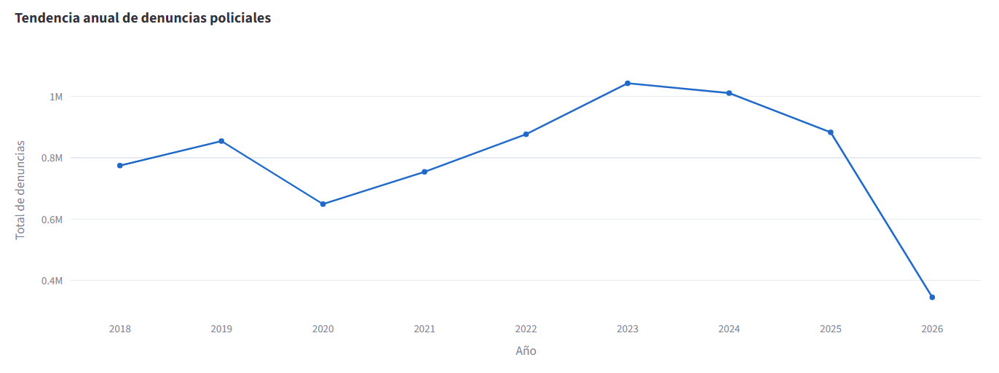
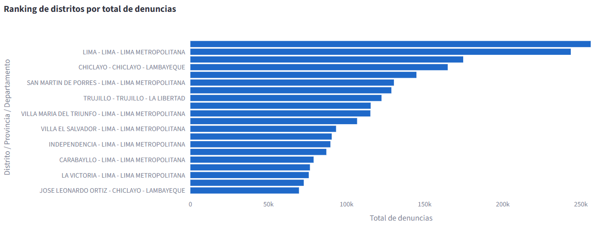
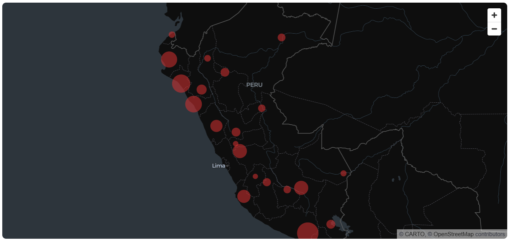

# Dashboard de Criminalidad en el Perú

Proyecto de análisis y visualización de datos públicos sobre denuncias policiales registradas en el Perú.
El dashboard fue desarrollado con **Python, SQL Server, Streamlit y Plotly**, usando información del **Sistema Informático de Denuncias Policiales - SIDPOL** del Ministerio del Interior.

---

## Descripción del proyecto

Este proyecto tiene como objetivo transformar datos públicos de criminalidad en indicadores visuales e interactivos para facilitar el análisis de denuncias policiales en el Perú.

El dashboard permite explorar la información por año, mes, departamento, provincia, distrito y modalidad del hecho denunciado.

La solución integra un flujo completo de datos:

```text
Dataset público CSV
        ↓
Limpieza y transformación con Python
        ↓
Carga a SQL Server
        ↓
Consultas y vistas analíticas
        ↓
Dashboard interactivo en Streamlit
```

---

## Fuente de datos

Los datos utilizados provienen del dataset público de denuncias policiales del **MININTER / SIDPOL**, disponible en el portal del Observatorio Nacional de Seguridad Ciudadana del Ministerio del Interior.

Fuente oficial: [Hechos delictivos basados en denuncias en el SIDPOL](https://www.datosabiertos.gob.pe/dataset/denuncias-policiales-1)

Archivo trabajado:

```text
DataSet Denuncias Policiales - Enero 2018 a Mayo 2026
```

Columnas principales del dataset:

```text
ANIO
MES
DPTO_HECHO_NEW
PROV_HECHO
DIST_HECHO
UBIGEO_HECHO
P_MODALIDADES
cantidad
```

> Nota: el proyecto analiza denuncias policiales registradas. Por lo tanto, los resultados no representan necesariamente la totalidad de delitos ocurridos, sino los hechos que fueron formalmente denunciados y registrados en SIDPOL.

---

## Tecnologías utilizadas

* Python
* Pandas
* SQL Server
* SQLAlchemy
* PyODBC
* Streamlit
* Plotly
* PyDeck
* Python Dotenv

---

## Funcionalidades principales

### Dashboard general

* KPIs principales:

  * Total de denuncias.
  * Total de registros agregados.
  * Total de departamentos.
  * Total de modalidades.
* Departamento con mayor cantidad de denuncias.
* Modalidad más reportada.
* Tendencia anual de denuncias.
* Tendencia mensual de denuncias.
* Ranking de departamentos con más denuncias.
* Ranking de modalidades más frecuentes.
* Mapa interactivo por departamento.

### Análisis detallado

* Filtros por:

  * Año.
  * Departamento.
  * Provincia.
  * Distrito.
  * Modalidad.
* Top 20 distritos con más denuncias.
* Evolución mensual por modalidad.
* Ranking de modalidades.
* Tabla detallada de registros.
* Descarga de datos filtrados en CSV.

### Página informativa

* Descripción del proyecto.
* Objetivo.
* Tecnologías usadas.
* Consideraciones sobre los datos.
* Valor del proyecto.

---

## Capturas del dashboard

### Dashboard general



### Análisis detallado



### Mapa interactivo



---

## Estructura del proyecto

```text
criminalidad-peru-dashboard/
│
├── app/
│   ├── 0_Dashboard_General.py
│   ├── db.py
│   └── pages/
│       ├── 1_Analisis_Detallado.py
│       └── 2_Acerca_del_Proyecto.py
│
├── data/
│   └── raw/
│       └── .gitkeep
│
├── database/
│   ├── 01_create_database.sql
│   ├── 02_create_views.sql
│   └── 03_departamentos_geo.sql
│
├── etl/
│   ├── 01_inspeccionar_dataset.py
│   └── 02_cargar_sql_server.py
│
├── docs/
│   └── capturas/
│       ├── dashboard_general.png
│       ├── analisis_detallado.png
│       └── mapa_denuncias.png
│
├── .env.example
├── .gitignore
├── requirements.txt
└── README.md
```

---

## Requisitos previos

Antes de ejecutar el proyecto, se debe contar con:

- Python 3.10 o superior.
- SQL Server instalado.
- SQL Server Management Studio.
- ODBC Driver 17 o 18 for SQL Server.
- Git.
- Dataset de denuncias policiales descargado desde la fuente oficial.

## Instalación del proyecto

### 1. Clonar el repositorio

```bash
git clone https://github.com/enleam/criminalidad-peru-dashboard.git
cd criminalidad-peru-dashboard
```

### 2. Crear entorno virtual

```bash
python -m venv venv
```

Activar entorno virtual en Windows:

```bash
venv\Scripts\activate
```

### 3. Instalar dependencias

```bash
pip install -r requirements.txt
```

---

## Configuración de variables de entorno

Crear un archivo `.env` en la raíz del proyecto tomando como referencia `.env.example`.

Ejemplo para autenticación de Windows:

```env
DB_SERVER=localhost\SQLEXPRESS
DB_DATABASE=CriminalidadPeruDB
DB_TRUSTED_CONNECTION=yes
DB_DRIVER=ODBC Driver 17 for SQL Server
```

Ejemplo para autenticación con usuario y contraseña:

```env
DB_SERVER=localhost\SQLEXPRESS
DB_DATABASE=CriminalidadPeruDB
DB_TRUSTED_CONNECTION=no
DB_USER=tu_usuario
DB_PASSWORD=tu_password
DB_DRIVER=ODBC Driver 17 for SQL Server
```

---

## Preparación de la base de datos

Ejecutar los scripts SQL en SQL Server Management Studio en este orden, antes de iniciar el dashboard:

```text
database/01_create_database.sql
database/02_create_views.sql
database/03_departamentos_geo.sql
```

El primer script crea la base de datos y la tabla principal:

```text
CriminalidadPeruDB
analytics.fact_denuncias
```

El segundo script crea vistas analíticas para KPIs, rankings y tendencias.

El tercer script crea una dimensión geográfica simple para representar denuncias por departamento en el mapa interactivo.

---

## Carga del dataset

Colocar el archivo CSV descargado en:

```text
data/raw/denuncias_policiales_2018_2026.csv
```

Luego ejecutar el script de inspección:

```bash
python etl/01_inspeccionar_dataset.py
```

Después ejecutar la carga a SQL Server:

```bash
python etl/02_cargar_sql_server.py
```

El proceso realiza:

* Lectura del CSV.
* Limpieza de nombres de columnas.
* Conversión de tipos de datos.
* Normalización de textos.
* Limpieza de UBIGEO.
* Creación de campo de periodo.
* Carga en SQL Server.

---

## Ejecución del dashboard

Ejecutar el dashboard con Streamlit:

```bash
streamlit run app/0_Dashboard_General.py
```

Luego abrir en el navegador:

```text
http://localhost:8501
```

---

## Modelo de datos usado

Tabla principal:

```text
analytics.fact_denuncias
```

Campos principales:

```text
denuncia_id
anio
mes
fecha_periodo
departamento
provincia
distrito
ubigeo
modalidad
cantidad
fuente
fecha_carga
```

Tabla geográfica:

```text
analytics.dim_departamento_geo
```

Campos principales:

```text
departamento
latitud
longitud
```

---

## Consultas analíticas implementadas

El proyecto permite obtener indicadores como:

```sql
SELECT SUM(cantidad) AS total_denuncias
FROM analytics.fact_denuncias;
```

```sql
SELECT TOP 10
    departamento,
    SUM(cantidad) AS total_denuncias
FROM analytics.fact_denuncias
GROUP BY departamento
ORDER BY total_denuncias DESC;
```

```sql
SELECT
    anio,
    SUM(cantidad) AS total_denuncias
FROM analytics.fact_denuncias
GROUP BY anio
ORDER BY anio;
```

---

## Consideraciones del análisis

* Los datos representan denuncias registradas, no necesariamente todos los delitos ocurridos.
* Puede existir subregistro, ya que no todos los hechos delictivos son denunciados.
* Las coordenadas usadas en el mapa son puntos de referencia aproximados por departamento.
* El dataset fue trabajado de forma agregada, usando el campo `cantidad` como valor principal de análisis.
* Los archivos de datos no se incluyen en el repositorio debido a su tamaño y porque deben descargarse desde la fuente oficial.

---

## Resultados esperados

El dashboard permite responder preguntas como:

* ¿Cuál es el total de denuncias registradas en el periodo analizado?
* ¿Qué departamentos concentran más denuncias?
* ¿Qué modalidades son las más frecuentes?
* ¿Cómo evolucionaron las denuncias por año?
* ¿Cómo varía la criminalidad registrada por provincia o distrito?
* ¿Qué distritos aparecen con mayor cantidad de denuncias?
* ¿Qué modalidades presentan mayor presencia en el tiempo?

---

## Futuras mejoras

* Implementar mapa choropleth con GeoJSON oficial por departamentos.
* Agregar análisis por provincias y distritos en mapa.
* Incorporar modelos predictivos simples de tendencia.
* Agregar comparación entre denuncias y población por departamento.
* Calcular tasas por cada 100 mil habitantes.
* Publicar el dashboard en Streamlit Community Cloud o servidor propio.
* Automatizar la descarga y actualización del dataset.
* Agregar pruebas básicas para los scripts ETL.

---

## Habilidades demostradas

Este proyecto demuestra conocimientos en:

* Análisis de datos públicos reales.
* Limpieza y transformación de datos con Python.
* Manejo de SQL Server para almacenamiento analítico.
* Creación de vistas SQL para indicadores.
* Desarrollo de dashboards interactivos.
* Visualización de datos con Plotly y PyDeck.
* Organización de un proyecto de datos para GitHub.
* Documentación técnica de un flujo ETL.

---

## Autor

**Flavio Enrique Huapaya Bohorquez**

Estudiante de Ingeniería de Sistemas  
Universidad Nacional Mayor de San Marcos

---

## Licencia

Este proyecto se desarrolla con fines educativos y de portafolio.

Los datos pertenecen a sus respectivas fuentes oficiales.